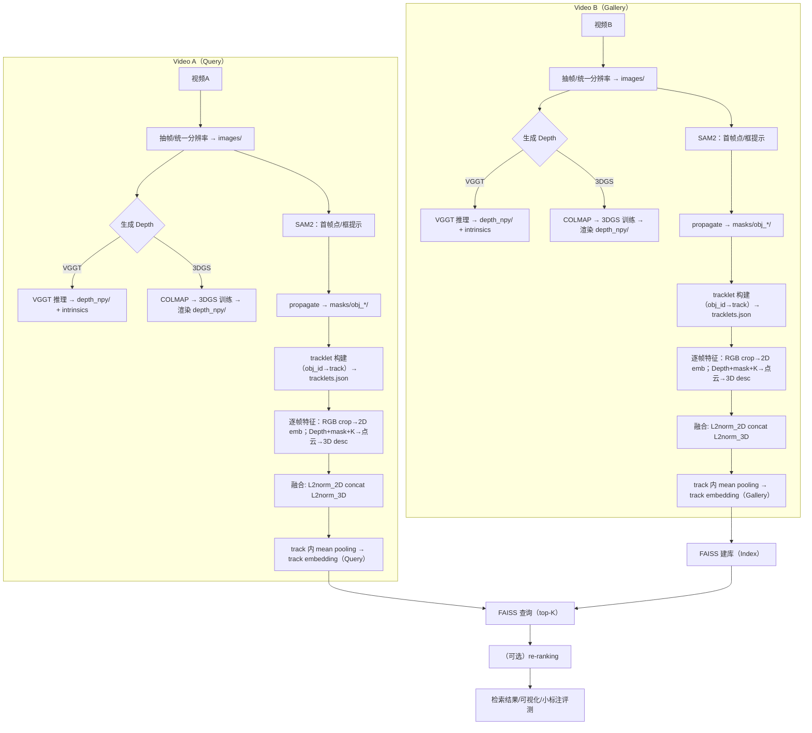

# 跨视角 3D ReID（任意物体实例）MVP：VGGT / 3DGS + SAM2 + RGB+几何检索（可复现流程）

本文档面向“**先跑通跨视角（跨视频/跨场景）3D 重识别 pipeline**，先不重点追求效果”的需求，给出：

1) 你在 `8.1 一条最省事的 MVP 组合`里列出的每个模块的**作用/输入输出/验收标准**；  
2) **VGGT 路线**与 **3DGS 路线**：从“拿到 depth”开始，一直到“完成 3D ReID 检索”的**完整可复现流程**（包含推荐的目录结构、命令模板、关键脚本骨架）。

> 目标定义：这里的“ReID”按 **实例检索/重识别**理解：把每个 tracklet（同一物体在一个视频里的连续片段）压成一个向量 `embedding`，跨视频做 top‑K 检索，看同一物体是否能被召回。

---

## 0. 总览：你要跑通的端到端数据流

```text
Video A / Video B
  ├─ (1) 抽帧得到 images/（建议统一分辨率/对齐策略）
  ├─ (2) 生成 depth（VGGT 或 3DGS 渲染）
  ├─ (3) SAM2：第一帧点/框提示 → propagate → 每帧实例 mask
  ├─ (4) 生成 tracklet（SAM2 的 object_id 就是 track；或用 tracker 关联）
  ├─ (5) 每帧：RGB crop → 2D embedding；Depth+mask → 点云 → 3D descriptor
  ├─ (6) 融合：L2norm(2D) ⊕ L2norm(3D)
  ├─ (7) 聚合：tracklet 内 mean pooling → track embedding
  └─ (8) 检索：FAISS 建库（gallery）→ query top‑K →（可选）re-ranking
```



---

## 1. MVP 组合（8.1）逐模块讲解：作用 / 产物 / 验收标准

下面的“验收标准”是为了 **快速定位 pipeline 断在哪一环**，不要求有 GT。

### 1.1 Depth：VGGT / 3DGS（逐帧推理得到 depth）

**作用**
- 给每个像素提供几何线索（距离/相对深度），用于：  
  1) 生成对象点云（3D descriptor）；  
  2) 作为跨视角不变性补充（形状/体积/局部曲率）。

**输入**
- 一段视频（抽帧后的 `images/*.jpg`）。

**输出（你后续最需要的最小集合）**
- 每帧对齐的深度图（建议 `.npy`，浮点）：`depth_npy/000001.npy`（H×W）
- （强烈推荐）相机内参 `K`（每帧一个或共享）  
  - VGGT：可直接预测 `intrinsic.npy`  
  - 3DGS：来自 COLMAP 的 `cameras.txt/bin`

**MVP 验收标准**
- **对齐**：随机抽 20 帧，把 depth 上色（colormap）叠加到 RGB，边缘大体一致。
- **有效像素比例**：mask 内 depth > 0 且 finite 的像素占比不能太低（<30% 往往难用）。
- **时序稳定性**：同一物体在相邻帧的 depth 分布不应剧烈跳变（否则 3D descriptor 会非常抖）。

---

### 1.2 实例 mask：SAM2（第一帧人工框/点一次，后续视频传播）

**作用**
- 把“对象几何/外观”从背景里分离出来：  
  - 深度/点云对背景非常敏感，不用 mask 很容易学到“场景”而不是“物体”。  
  - mask 还能稳定 crop（减少 bbox 抖动）。

**输入**
- `images/*.jpg`（与 depth 同分辨率/同坐标系）。
- 少量交互提示：点/框（第一帧，或失败帧修正）。

**输出（推荐保存方式）**
- 每个对象的每帧 mask：`masks/obj_{id}/000001.png`（0/255）
- 或者保存为 RLE/npz（更省空间），并附上 `object_id`、`frame_idx`。

**MVP 验收标准**
- 连续帧中 mask 面积变化平滑，不应频繁“丢失/跳到别的物体”。
- 失败帧比例可统计（比如每 100 帧失败 < 10 帧）。

---

### 1.3 跟踪 / tracklet：SAM2 video 或 YOLO+ByteTrack/BoT‑SORT

**作用**
- 把“同一物体在一段视频里的多个帧”聚合成一个 tracklet，后续才能做：  
  - 多帧 pooling（更稳）  
  - 伪正样本（同一 track 内多帧）

**建议（MVP 最省事）**
- 如果你用 `SAM2VideoPredictor`：**object_id = tracklet_id**，不需要再跑 tracker。
- 如果你只用 bbox：再接 `ByteTrack/BoT‑SORT` 做关联。

**输出**
- 一个 tracklet 清单（json/yaml）：每个对象包含帧列表、对应 mask 路径、可选 bbox。

**MVP 验收标准**
- track 平均长度够长（例如 > 30 帧），断裂率低（同一物体被切成多个 track 的比例低）。

---

### 1.4 几何：Depth + mask → 对象点云（反投影 + 采样 + 单位球归一化）

**作用**
- 把 depth 变成 3D 点集（点云），让“形状/体积/局部结构”进入 ReID 表征。

**关键建议（避免 K/crop 的坑）**
- MVP 阶段：**不要先 crop 再反投影**（会引入 K 的裁剪/缩放修正）；  
  直接在**整张图坐标系**里用 `depth + K + mask` 生成点云最稳。

**输出**
- 每帧一个对象点云（`.ply` 或 `.npy`），或每个 track 聚合成一个点云。

**MVP 验收标准**
- 点云离群点比例不高；同一 track 内点云“形状”大致一致。
- 做 unit-sphere 归一化后，点云尺度稳定（避免“深度绝对尺度”泄漏成 ID 线索）。

---

### 1.5 表征：RGB 用 DINOv2/CLIP；3D 用零训练几何描述子（FPFH/SHOT 等）

**作用**
- 2D embedding：捕获纹理/颜色/局部外观。  
- 3D descriptor：捕获几何结构（对光照变化更稳）。

**推荐（先跑通）**
- 2D：`CLIP(open_clip)`（安装/调用相对简单）  
- 3D：`Open3D FPFH`（Open3D 自带实现；ESF 在 PCL 里更常见，Open3D 不一定直接提供）

**MVP 验收标准**
- 同一 track 内 embedding 两两余弦相似度，明显高于不同 track（哪怕提升不大也行）。
- embedding 不塌缩（向量方差不接近 0）。

---

### 1.6 融合：L2norm(RGB_emb) ⊕ L2norm(3D_emb)（concat）

**作用**
- 最简单地把两种信息合并，避免复杂融合模块带来更多调参。

**推荐实现**
- 先分别 L2 normalize，再 `np.concatenate([rgb, geo], axis=-1)`。
- 可选加权：`[w*rgb, (1-w)*geo]`（MVP 可以先不加）。

**MVP 验收标准**
- 融合后相似度排序更符合直觉（top‑K 更少被“背景相似”误导）。

---

### 1.7 聚合：tracklet 内 mean pooling

**作用**
- 降低单帧噪声（遮挡/模糊/深度抖动），得到更稳定的实例向量。

**推荐**
- 每个 track 抽 K 帧（如 10–30 帧均匀采样），每帧算 embedding，最后平均。

**MVP 验收标准**
- pooling 后同一 track 内相似度方差下降；跨视频检索结果更稳定。

---

### 1.8 检索：FAISS（cosine/inner-product）+（可选）k-reciprocal re-ranking

**作用**
- 把所有 track embedding 建库，实现跨视频 top‑K 检索。

**推荐**
- cosine 检索：对 embedding 做 L2norm 后，用 `IndexFlatIP`（inner product = cosine）。
- re-ranking：等 MVP 跑通后再加。

**MVP 验收标准**
- 能在 gallery 里找回你肉眼认为“同一个物体”的 top‑K（哪怕 K=10）。
- 延迟可接受（track 数量不大时，毫秒级）。

---

## 2. 推荐目录结构与中间产物格式（强烈建议照这个存）

建议你把“每个视频”处理成一个 `SCENE_DIR`，这样 VGGT/3DGS 都能复用：

```text
SCENE_DIR/
  images/                  # 用于 depth 与 SAM2 的统一输入帧（强烈建议固定分辨率）
    000001.jpg
    000002.jpg
  depth/
    vggt/
      depth_npy/000001.npy
      depth_conf_npy/000001.npy
      intrinsic.npy         # (S,3,3) or (3,3)
      extrinsic.npy         # (S,3,4) 可选
      image_list.txt
    3dgs/
      depth_npy/000001.npy  # 建议用 image stem 命名，避免 idx 对齐问题
      cameras.txt           # 从 COLMAP 导出（推荐）
      images.txt
  masks/
    obj_000/
      000001.png
      000002.png
    obj_001/
      ...
  tracklets.json            # 见下方 schema
  embeddings/
    tracks.npy              # (N_tracks, D)
    tracks_meta.json        # track_id → video/object/frame 范围等
```

`tracklets.json`（最小 schema 示例）：

```json
[
  {
    "track_id": "videoA_obj_000",
    "scene_dir": "/abs/path/to/SCENE_DIR",
    "object_id": 0,
    "frame_names": ["000001.jpg", "000002.jpg"],
    "mask_paths": ["masks/obj_000/000001.png", "masks/obj_000/000002.png"]
  }
]
```

---

## 3. 通用“depth → 3D ReID”流程（VGGT 与 3DGS 共用）

下面这部分是 **拿到 depth 之后**，两条路线完全一致的后处理。

### 3.1 生成 masks（SAM2VideoPredictor）

SAM2 官方 repo 的关键流程是：`init_state` → `add_new_points_or_box` → `propagate_in_video`。

建议你把 SAM2 跟其他模块放在**独立环境**（SAM2 需要较新的 torch）。

Linux 安装/下载权重（来自官方 README）：

```bash
git clone https://github.com/facebookresearch/sam2.git && cd sam2
pip install -e .
cd checkpoints && ./download_ckpts.sh && cd ..
```

最小用法（伪代码，保存每帧 mask）：

```python
import os
import numpy as np
import cv2
import torch
from sam2.build_sam import build_sam2_video_predictor

checkpoint = "./checkpoints/sam2.1_hiera_large.pt"
model_cfg = "configs/sam2.1/sam2.1_hiera_l.yaml"
predictor = build_sam2_video_predictor(model_cfg, checkpoint)

video_dir = "/abs/path/to/SCENE_DIR/images"   # 一个目录就是一个视频
out_dir = "/abs/path/to/SCENE_DIR/masks"
os.makedirs(out_dir, exist_ok=True)

with torch.inference_mode(), torch.autocast("cuda", dtype=torch.bfloat16):
    state = predictor.init_state(video_dir)  # 也可以传视频帧数组，按官方 notebook 来
    # 在 frame_idx=0 给一个 box 或点（你可以先手动从 UI 取坐标）
    frame_idx = 0
    obj_id = 0
    box = np.array([x1, y1, x2, y2], dtype=np.float32)  # 例
    frame_idx, object_ids, masks = predictor.add_new_points_or_box(state, box=box, frame_idx=frame_idx, obj_id=obj_id)

    for frame_idx, object_ids, masks in predictor.propagate_in_video(state):
        # masks: (num_obj, H, W) bool/float
        for oi, oid in enumerate(object_ids):
            obj_dir = os.path.join(out_dir, f"obj_{int(oid):03d}")
            os.makedirs(obj_dir, exist_ok=True)
            m = (masks[oi] > 0).cpu().numpy().astype(np.uint8) * 255
            cv2.imwrite(os.path.join(obj_dir, f"{frame_idx+1:06d}.png"), m)
```

> MVP 经验：先只标 1–3 个对象，保证流程能跑通；后续再考虑自动发现（GroundingDINO/OWL‑ViT）。

---

### 3.2 由 mask 生成 tracklets.json

规则（MVP）：
- 以 `masks/obj_XXX` 为单位就是一个 tracklet；
- frame_names 取 `images/` 里同名帧；如果某帧 mask 为空，就跳过该帧。

你只需要保证：**mask 文件名与 image 文件名严格对齐**（这比任何模型都重要）。

---

### 3.3 Depth + K + mask → 点云（并采样/归一化）

反投影公式（OpenCV 像素坐标）：
- `X = (u - cx) / fx * Z`
- `Y = (v - cy) / fy * Z`
- `Z = depth(u,v)`

MVP 选择：
- 每帧从 mask 区域随机采样 `N=2048` 个点；
- 对每帧点云做 `center + unit sphere` 归一化；
- tracklet 级别：把多帧点云拼在一起，再采样一次（可选）。

---

### 3.4 2D embedding：CLIP（示例）

建议用 `open_clip_torch`（pip 安装方便），对 **RGB crop** 提取 embedding。

关键点：
- crop 用 mask 的 bbox（或直接用 mask 把背景置 0 再 resize）；
- 最后 L2 normalize。

---

### 3.5 3D descriptor：Open3D FPFH（示例）

FPFH 需要法向：
- 先估计 normals；
- 再计算 FPFH；
- 最后做一个全局聚合（例如对 FPFH 的 33 维做均值/最大池化），得到单向量。

> 这不是最强的 3D 表征，但足够你验证“几何分支的数据流”。

---

### 3.6 融合 + track pooling + FAISS 检索

推荐最小做法：
- 每帧：`f = concat(l2(rgb_feat), l2(geo_feat))`
- track：`F = mean(f_i)`，再 L2norm
- 建库：`faiss.IndexFlatIP(D)`，直接 add gallery，search query

---

## 4. VGGT 路线：拿到 depth 以后怎么做完整 3D ReID（可复现步骤）

### 4.1 前置产物（VGGT 侧）

你需要保证已经有：
- `SCENE_DIR/images/*.jpg`
- `SCENE_DIR/depth/vggt/depth_npy/*.npy`
- `SCENE_DIR/depth/vggt/intrinsic.npy`（最好有）

VGGT 的 depth+camera 生成命令模板见：`rgbd_3d_reid_pipeline_routes.md` 的 **10.3**（或同名 ipynb）。

### 4.2 后续步骤（与第 3 节完全一致）

1) SAM2 生成 `masks/obj_*/frame.png`  
2) 生成 `tracklets.json`  
3) 每个 tracklet：多帧采样 → RGB embedding + 点云 FPFH → 融合 → track pooling  
4) 把所有 track embedding 写到 `embeddings/tracks.npy`，元信息写到 `embeddings/tracks_meta.json`  
5) 用 FAISS 建库与查询

**MVP 验收方法**
- 先只做“同一物体在两个视频里”的少量示例：  
  手工选 5–10 个 query track，目测 top‑10 是否能召回同一物体；  
  再做一个 20–50 对的小标注算 `Recall@K`。

---

## 5. 3DGS 路线：拿到 depth 以后怎么做完整 3D ReID（可复现步骤）

### 5.1 前置产物（3DGS 侧）

你需要保证已经有：
- `SCENE_DIR/images/*.png/jpg`（注意：建议直接在 3DGS 的 **undistorted images** 上做 SAM2，才能与渲染 depth 对齐）
- `SCENE_DIR/sparse/0/{cameras.bin,images.bin,points3D.bin}`（COLMAP 输出）
- `MODEL_DIR/.../depth_npy/*.npy`（3DGS 渲染的 depth）

3DGS 的训练/渲染命令模板见：`rgbd_3d_reid_pipeline_routes.md` 的 **10.2**（或同名 ipynb）。

**强烈建议：把渲染的 depth 直接按 image name 保存**
- 这样你就能用文件名对齐：`images/000123.png` ↔ `depth_npy/000123.npy`
- 否则只保存 idx（00000.npy）会遇到“相机列表顺序不透明”的对齐坑。

### 5.2 后续步骤（与第 3 节完全一致）

1) 在 `SCENE_DIR/images` 上跑 SAM2，输出 `masks/obj_*/*.png`  
2) 用 COLMAP 的 `cameras` 得到 `K`（建议用 `colmap model_converter` 导出 txt，再解析）  
3) depth + K + mask → 点云 → FPFH  
4) RGB crop → 2D embedding  
5) 融合 + track pooling + FAISS 检索

### 5.3 3DGS 路线的额外注意事项（不然很容易“跑不通”）

- **动态物体**：经典 3DGS 更适合静态场景；视频里大面积运动的物体会导致重建/深度不可靠。  
  MVP 阶段优先用：围绕静态物体/桌面物体环拍的视频，或相机运动+场景静态。
- **对齐坐标系**：一定在 `SCENE_DIR/images`（undistorted）上做 SAM2，别在 `input/` 原始畸变图上做。

---

## 6. 最小依赖清单（你真正需要装什么）

按模块拆环境更稳（避免 torch 版本冲突）：

- `vggt` 环境：VGGT 推理（torch 2.3.1，见 VGGT repo requirements）
- `gs` 环境：3DGS 训练/渲染（graphdeco gaussian-splatting 的 conda env）
- `sam2` 环境：SAM2 视频分割（torch >=2.5.1）
- `reid` 环境：embedding + open3d + faiss（可以和 sam2 合并）

最小 Python 包（做 ReID/检索用）：
- `open3d`（点云/FPFH）
- `open_clip_torch`（CLIP embedding）
- `faiss-cpu`（或 conda 的 `faiss-gpu`）
- `opencv-python`、`numpy`、`scipy`、`tqdm`

---

## 7. 你下一步怎么做（推荐最小行动顺序）

1) 先选 VGGT 路线，跑通一个 `SCENE_DIR`：`images + depth + masks` 都对齐  
2) 只标 1–2 个对象，用 SAM2 propagate 得到一个长 tracklet  
3) 先只做单视频内：看相邻帧 pooling 后的 embedding 是否稳定  
4) 再做两段视频：建 FAISS，看看 top‑K 是否能召回  
5) 最后再考虑 3DGS（如果你的场景适合静态重建）

---

## 8. 可直接复制运行的最小脚本（从 depth/mask 到 FAISS 检索）

这部分给一套“能跑就行”的参考实现：你复制脚本到同级目录执行即可。为了避免 torch 版本冲突，建议在 `reid` 环境里跑（CPU 也能跑通，但会慢）。

### 8.1 创建 reid 环境（Linux）

```bash
conda create -n reid python=3.10 -y
conda activate reid

# 需要 torch（给 CLIP 用）；GPU 就换成 cu121/cu118
pip install torch torchvision --index-url https://download.pytorch.org/whl/cpu

pip install numpy pillow opencv-python tqdm
pip install open3d
pip install faiss-cpu
pip install open_clip_torch
```

### 8.2 从 `masks/obj_*` 生成 `tracklets.json`

```bash
cat > make_tracklets_from_masks.py <<'PY'
import argparse
import json
from pathlib import Path

def main():
    ap = argparse.ArgumentParser()
    ap.add_argument("--scene_dir", required=True)
    ap.add_argument("--images_dir", default="images")
    ap.add_argument("--masks_dir", default="masks")
    ap.add_argument("--out", default="tracklets.json")
    args = ap.parse_args()

    scene_dir = Path(args.scene_dir)
    images_dir = scene_dir / args.images_dir
    masks_dir = scene_dir / args.masks_dir

    obj_dirs = sorted([p for p in masks_dir.glob("obj_*") if p.is_dir()])
    if not obj_dirs:
        raise SystemExit(f"No obj_* dirs found under: {masks_dir}")

    tracklets = []
    for obj_dir in obj_dirs:
        mask_paths = sorted(obj_dir.glob("*.png"))
        frame_names = []
        kept_masks = []
        for mp in mask_paths:
            stem = mp.stem
            # 优先匹配同 stem 的 jpg/png
            img = images_dir / f"{stem}.jpg"
            if not img.exists():
                img = images_dir / f"{stem}.png"
            if not img.exists():
                continue
            frame_names.append(img.name)
            kept_masks.append(str(mp.relative_to(scene_dir)))

        if len(frame_names) < 2:
            continue

        tracklets.append(
            {
                "track_id": f"{scene_dir.name}_{obj_dir.name}",
                "scene_dir": str(scene_dir),
                "object_id": obj_dir.name,
                "frame_names": frame_names,
                "mask_paths": kept_masks,
            }
        )

    out_path = scene_dir / args.out
    out_path.write_text(json.dumps(tracklets, ensure_ascii=False, indent=2), encoding="utf-8")
    print(f"Wrote {len(tracklets)} tracklets to: {out_path}")

if __name__ == "__main__":
    main()
PY

python make_tracklets_from_masks.py --scene_dir /abs/path/to/SCENE_DIR
```

### 8.3（可选但推荐）把相机内参导出成 `intrinsics.json`

后续点云反投影只需要 `fx,fy,cx,cy`。为了统一，建议把不同来源（VGGT / COLMAP）都导出到同一个 `intrinsics.json`：

#### 8.3.1 VGGT → intrinsics.json

假设你已有 `SCENE_DIR/vggt_out/intrinsic.npy`（形状 `(S,3,3)`）和 `SCENE_DIR/vggt_out/image_list.txt`：

```bash
cat > export_vggt_intrinsics_json.py <<'PY'
import argparse
import json
from pathlib import Path
import numpy as np

def main():
    ap = argparse.ArgumentParser()
    ap.add_argument("--vggt_out", required=True, help="e.g., SCENE_DIR/vggt_out")
    ap.add_argument("--out", required=True, help="e.g., SCENE_DIR/intrinsics.json")
    args = ap.parse_args()

    vggt_out = Path(args.vggt_out)
    K = np.load(vggt_out / "intrinsic.npy")  # (S,3,3)
    names = (vggt_out / "image_list.txt").read_text(encoding="utf-8").splitlines()
    names = [n.strip() for n in names if n.strip()]
    if len(names) != K.shape[0]:
        raise SystemExit(f"image_list.txt size {len(names)} != intrinsic.npy frames {K.shape[0]}")

    out = {}
    for i, name in enumerate(names):
        stem = Path(name).stem
        fx = float(K[i, 0, 0]); fy = float(K[i, 1, 1]); cx = float(K[i, 0, 2]); cy = float(K[i, 1, 2])
        out[stem] = {"fx": fx, "fy": fy, "cx": cx, "cy": cy}

    Path(args.out).write_text(json.dumps(out, ensure_ascii=False, indent=2), encoding="utf-8")
    print(f"Wrote {len(out)} intrinsics to: {args.out}")

if __name__ == "__main__":
    main()
PY

python export_vggt_intrinsics_json.py \
  --vggt_out /abs/path/to/SCENE_DIR/vggt_out \
  --out /abs/path/to/SCENE_DIR/intrinsics.json
```

#### 8.3.2 COLMAP（3DGS）→ intrinsics.json

把 COLMAP binary 导出 TXT（推荐）：

```bash
colmap model_converter \
  --input_path /abs/path/to/SCENE_DIR/sparse/0 \
  --output_path /abs/path/to/SCENE_DIR/sparse_txt \
  --output_type TXT
```

导出后运行：

```bash
cat > export_colmap_intrinsics_json.py <<'PY'
import argparse
import json
from pathlib import Path

def parse_cameras(cameras_txt: Path):
    cams = {}
    for line in cameras_txt.read_text(encoding="utf-8").splitlines():
        line = line.strip()
        if not line or line.startswith("#"):
            continue
        parts = line.split()
        cam_id = int(parts[0])
        model = parts[1]
        width = int(parts[2]); height = int(parts[3])
        params = list(map(float, parts[4:]))
        if model == "SIMPLE_PINHOLE":
            f, cx, cy = params[:3]
            fx = fy = f
        elif model == "PINHOLE":
            fx, fy, cx, cy = params[:4]
        else:
            raise ValueError(f"Unsupported camera model for MVP: {model}")
        cams[cam_id] = {"fx": fx, "fy": fy, "cx": cx, "cy": cy, "width": width, "height": height, "model": model}
    return cams

def parse_images(images_txt: Path):
    # images.txt 每张图占两行：第一行是位姿/相机/文件名，第二行是点（可忽略）
    lines = [ln.strip() for ln in images_txt.read_text(encoding="utf-8").splitlines() if ln.strip() and not ln.startswith("#")]
    out = []
    i = 0
    while i < len(lines):
        parts = lines[i].split()
        img_id = int(parts[0])
        cam_id = int(parts[8])
        name = parts[9]
        out.append((img_id, cam_id, name))
        i += 2
    return out

def main():
    ap = argparse.ArgumentParser()
    ap.add_argument("--cameras_txt", required=True)
    ap.add_argument("--images_txt", required=True)
    ap.add_argument("--out", required=True)
    args = ap.parse_args()

    cams = parse_cameras(Path(args.cameras_txt))
    imgs = parse_images(Path(args.images_txt))

    out = {}
    for _, cam_id, name in imgs:
        stem = Path(name).stem
        c = cams[cam_id]
        out[stem] = {"fx": float(c["fx"]), "fy": float(c["fy"]), "cx": float(c["cx"]), "cy": float(c["cy"])}

    Path(args.out).write_text(json.dumps(out, ensure_ascii=False, indent=2), encoding="utf-8")
    print(f"Wrote {len(out)} intrinsics to: {args.out}")

if __name__ == "__main__":
    main()
PY

python export_colmap_intrinsics_json.py \
  --cameras_txt /abs/path/to/SCENE_DIR/sparse_txt/cameras.txt \
  --images_txt /abs/path/to/SCENE_DIR/sparse_txt/images.txt \
  --out /abs/path/to/SCENE_DIR/intrinsics.json
```

### 8.4 提取 track embedding（CLIP + Open3D FPFH + 融合 + mean pooling）

约定：
- 图片：`SCENE_DIR/images/<stem>.jpg|png`
- mask：`SCENE_DIR/masks/obj_*/<stem>.png`（0/255）
- depth：`DEPTH_DIR/<stem>.npy`
- 相机内参：`SCENE_DIR/intrinsics.json`（上一节导出）

```bash
cat > extract_track_embeddings.py <<'PY'
import argparse
import json
from pathlib import Path

import cv2
import numpy as np
import open3d as o3d
import torch
from PIL import Image
import open_clip
from tqdm import tqdm

def l2norm(x: np.ndarray, eps: float = 1e-12) -> np.ndarray:
    n = float(np.linalg.norm(x))
    return x / (n + eps)

def load_mask(path: Path) -> np.ndarray:
    m = cv2.imread(str(path), cv2.IMREAD_GRAYSCALE)
    if m is None:
        raise FileNotFoundError(path)
    return (m > 0)

def mask_bbox(mask: np.ndarray):
    ys, xs = np.where(mask)
    if ys.size == 0:
        return None
    y1, y2 = int(ys.min()), int(ys.max()) + 1
    x1, x2 = int(xs.min()), int(xs.max()) + 1
    return x1, y1, x2, y2

def depth_to_points(depth: np.ndarray, K: dict, mask: np.ndarray):
    fx, fy, cx, cy = K["fx"], K["fy"], K["cx"], K["cy"]
    H, W = depth.shape
    ys, xs = np.indices((H, W))
    z = depth.astype(np.float32)
    valid = np.isfinite(z) & (z > 0) & mask
    if valid.sum() < 50:
        return np.zeros((0, 3), dtype=np.float32)
    xs = xs[valid].astype(np.float32)
    ys = ys[valid].astype(np.float32)
    zs = z[valid]
    X = (xs - cx) / fx * zs
    Y = (ys - cy) / fy * zs
    pts = np.stack([X, Y, zs], axis=1).astype(np.float32)
    return pts

def normalize_unit_sphere(pts: np.ndarray, eps: float = 1e-6) -> np.ndarray:
    if pts.shape[0] == 0:
        return pts
    c = pts.mean(axis=0, keepdims=True)
    pts0 = pts - c
    r = np.linalg.norm(pts0, axis=1).max()
    return (pts0 / (r + eps)).astype(np.float32)

def sample_points(pts: np.ndarray, n: int) -> np.ndarray:
    if pts.shape[0] <= n:
        return pts
    idx = np.random.choice(pts.shape[0], size=n, replace=False)
    return pts[idx]

def fpfh_global(pts: np.ndarray) -> np.ndarray:
    # pts: (N,3) float32 (已 unit-sphere)
    if pts.shape[0] < 100:
        return np.zeros((33,), dtype=np.float32)

    pcd = o3d.geometry.PointCloud()
    pcd.points = o3d.utility.Vector3dVector(pts.astype(np.float64))

    # 下采样 + 法向 + FPFH
    pcd = pcd.voxel_down_sample(voxel_size=0.02)
    if np.asarray(pcd.points).shape[0] < 50:
        return np.zeros((33,), dtype=np.float32)

    pcd.estimate_normals(search_param=o3d.geometry.KDTreeSearchParamHybrid(radius=0.1, max_nn=30))
    feat = o3d.pipelines.registration.compute_fpfh_feature(
        pcd, o3d.geometry.KDTreeSearchParamHybrid(radius=0.2, max_nn=100)
    )
    f = np.asarray(feat.data).astype(np.float32)  # (33, npts)
    return f.mean(axis=1)  # (33,)

def build_clip(device: str, model_name: str = "ViT-B-32", pretrained: str = "laion2b_s34b_b79k"):
    model, _, preprocess = open_clip.create_model_and_transforms(model_name, pretrained=pretrained)
    model = model.to(device).eval()
    return model, preprocess

@torch.no_grad()
def clip_embed(model, preprocess, device: str, pil_img: Image.Image) -> np.ndarray:
    x = preprocess(pil_img).unsqueeze(0).to(device)
    feat = model.encode_image(x)
    feat = feat / feat.norm(dim=-1, keepdim=True)
    return feat[0].detach().cpu().numpy().astype(np.float32)

def main():
    ap = argparse.ArgumentParser()
    ap.add_argument("--scene_dir", required=True)
    ap.add_argument("--tracklets", default="tracklets.json")
    ap.add_argument("--depth_dir", required=True, help="directory of <stem>.npy")
    ap.add_argument("--intrinsics_json", required=True)
    ap.add_argument("--out_dir", default="embeddings")
    ap.add_argument("--frames_per_track", type=int, default=20)
    ap.add_argument("--n_points", type=int, default=2048)
    ap.add_argument("--device", default="cuda" if torch.cuda.is_available() else "cpu")
    args = ap.parse_args()

    np.random.seed(0)

    scene_dir = Path(args.scene_dir)
    depth_dir = Path(args.depth_dir)
    out_dir = scene_dir / args.out_dir
    out_dir.mkdir(parents=True, exist_ok=True)

    tracklets = json.loads((scene_dir / args.tracklets).read_text(encoding="utf-8"))
    intr = json.loads(Path(args.intrinsics_json).read_text(encoding="utf-8"))

    clip_model, clip_preprocess = build_clip(args.device)

    all_embs = []
    all_meta = []

    for t in tqdm(tracklets, desc="Tracks"):
        frame_names = t["frame_names"]
        mask_paths = t["mask_paths"]
        assert len(frame_names) == len(mask_paths)

        if len(frame_names) == 0:
            continue

        # 均匀采样 frames_per_track
        k = min(args.frames_per_track, len(frame_names))
        idxs = np.linspace(0, len(frame_names) - 1, num=k)
        idxs = np.round(idxs).astype(int).tolist()

        fused_list = []
        used_frames = []

        for j in idxs:
            img_name = frame_names[j]
            stem = Path(img_name).stem

            img_path = scene_dir / "images" / img_name
            m_path = scene_dir / mask_paths[j]
            d_path = depth_dir / f"{stem}.npy"
            if not d_path.exists():
                continue
            if stem not in intr:
                continue

            mask = load_mask(m_path)
            bbox = mask_bbox(mask)
            if bbox is None:
                continue
            x1, y1, x2, y2 = bbox
            if (x2 - x1) < 10 or (y2 - y1) < 10:
                continue

            # RGB embedding（crop）
            pil = Image.open(img_path).convert("RGB")
            pil_crop = pil.crop((x1, y1, x2, y2))
            rgb_feat = clip_embed(clip_model, clip_preprocess, args.device, pil_crop)

            # 3D descriptor（depth+mask → 点云 → FPFH）
            depth = np.load(d_path).astype(np.float32)
            pts = depth_to_points(depth, intr[stem], mask)
            pts = sample_points(pts, args.n_points)
            pts = normalize_unit_sphere(pts)
            geo_feat = fpfh_global(pts)
            geo_feat = l2norm(geo_feat)

            fused = np.concatenate([rgb_feat, geo_feat], axis=0).astype(np.float32)
            fused = l2norm(fused)

            fused_list.append(fused)
            used_frames.append(img_name)

        if len(fused_list) == 0:
            continue

        track_emb = np.stack(fused_list, axis=0).mean(axis=0)
        track_emb = l2norm(track_emb).astype(np.float32)

        all_embs.append(track_emb)
        all_meta.append(
            {
                "track_id": t["track_id"],
                "scene_dir": t["scene_dir"],
                "object_id": t["object_id"],
                "used_frames": used_frames,
            }
        )

    embs = np.stack(all_embs, axis=0).astype(np.float32) if all_embs else np.zeros((0, 1), dtype=np.float32)
    np.save(out_dir / "tracks.npy", embs)
    (out_dir / "tracks_meta.json").write_text(json.dumps(all_meta, ensure_ascii=False, indent=2), encoding="utf-8")
    print(f"Saved embeddings: {out_dir/'tracks.npy'} shape={embs.shape}")

if __name__ == "__main__":
    main()
PY
```

运行示例（VGGT route）：

```bash
# depth npy 按 image stem 命名：000001.npy ↔ 000001.jpg
python extract_track_embeddings.py \
  --scene_dir /abs/path/to/SCENE_DIR \
  --depth_dir /abs/path/to/SCENE_DIR/vggt_out/depth_npy \
  --intrinsics_json /abs/path/to/SCENE_DIR/intrinsics.json
```

运行示例（3DGS route）：

```bash
python extract_track_embeddings.py \
  --scene_dir /abs/path/to/SCENE_DIR \
  --depth_dir /abs/path/to/DEPTH_NPY_DIR \
  --intrinsics_json /abs/path/to/SCENE_DIR/intrinsics.json
```

### 8.5 FAISS 建库与查询（最小示例）

```bash
cat > faiss_search_demo.py <<'PY'
import json
from pathlib import Path
import numpy as np
import faiss

emb = np.load("/abs/path/to/SCENE_DIR/embeddings/tracks.npy").astype("float32")
meta = json.loads(Path("/abs/path/to/SCENE_DIR/embeddings/tracks_meta.json").read_text(encoding="utf-8"))

faiss.normalize_L2(emb)
index = faiss.IndexFlatIP(emb.shape[1])
index.add(emb)

k = 10
D, I = index.search(emb, k)

for qi in range(min(5, len(meta))):
    print("Query:", meta[qi]["track_id"])
    for rank in range(k):
        gi = int(I[qi, rank])
        print("  ", rank, float(D[qi, rank]), meta[gi]["track_id"])
PY

python faiss_search_demo.py
```
