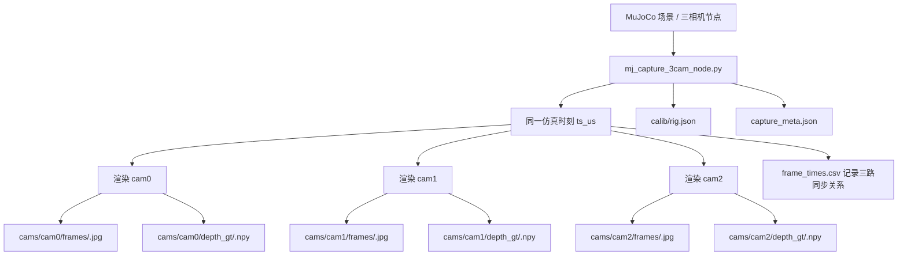

# mvp-demo 当前进展组会汇报思路

## 1. 汇报核心结论

这次组会最适合强调的不是“已经做完了完整的 3D ReID 系统”，而是：

1. `mvp-demo` 已经从早期的单路视频 `YOLO 门控 + 3DGS`，推进到了面向后续真实部署的“`三相机节点级闭环`”。
2. 当前主链路已经打通：`三路同步采集 -> depth/mask 对齐 -> 多相机点云融合 -> node-level tracklet -> track embedding -> retrieval eval 接口`。
3. 现在最有说服力的成果是“链路跑通 + 中间产物完整 + 节点级数据组织合理”，而不是“跨场景检索指标已经很好”。

建议把整场汇报的主标题讲成：

`三相机节点级 3D-aware ReID MVP：从同步观测到轨迹表征`

## 2. 当前已实现内容

### 2.1 场景与节点建模

- 已构建 MuJoCo 三相机节点。
- 每个节点包含 `cam0/cam1/cam2` 三个相机。
- 三相机光轴平行，基线受控，适合作为“节点内几何融合”的最小单元。
- 已有 viewer 和验证脚本，可以证明相机布局和朝向符合预期。

建议汇报时明确一句：

`我现在不是直接做全局多相机系统，而是先把“每个节点由 3 台相机构成”的局部 3D 感知单元搭起来。`

### 2.2 节点级数据采集

- 当前稳定采集脚本是 `scripts/mj_capture_3cam_node.py`，预览脚本是 `scripts/mj_view_3cam_node.py`。
- 采集时每个仿真时刻都会同时渲染 `cam0/cam1/cam2`，因此三路图像和深度天然共享同一个时间戳 `ts_us`。
- 采集结束后会固定输出：
  - `cams/cam*/frames/*.jpg`：三路同步 RGB。
  - `cams/cam*/depth_gt/*.npy`：三路同步深度。
  - `cams/cam*/masks_gt/*.png`：调试用 GT mask。
  - `calib/rig.json`：节点内三相机的外参与内参。
  - `frame_times.csv`：每个 `ts_us` 对应三路图像文件名。
  - `capture_meta.json`：场景参数、分辨率、FPS、轨迹、baseline 等元信息。
- 这套数据组织已经和后续真实系统接口对齐，后面只需要把 `depth_gt/masks_gt` 换成预测 `depth/masks`，不需要重写下游结构。
- 最新稳定样例是：
  `mvp-demo/data/nodes/node01/scenes/mj_node01_20260315_group_demo01`
- 这一轮参数为 `10s x 10fps x 640x480`，已经稳定得到：
  - `100` 个同步时间戳。
  - `3 x 100` 张 RGB。
  - `3 x 100` 张深度。
  - 完整的 `rig.json + frame_times.csv + capture_meta.json`。

建议这一页直接强调一句：

`我现在已经可以稳定得到 3 个相机在同一时刻的同步 RGB 和深度数据，这意味着节点级几何融合所需的最小输入已经稳定。`

建议在汇报里放一个小目录图：

```text
scene_dir/
  capture_meta.json
  frame_times.csv
  calib/
    rig.json
  cams/
    cam0/
      frames/*.jpg
      depth_gt/*.npy
      masks_gt/*.png
    cam1/
      ...
    cam2/
      ...
```

建议直接放下面这张流程图，作为“稳定得到 3 相机同步 RGB 和深度”的证据：



如果展示环境不支持 Mermaid，也可以改成这一版：

```text
MuJoCo 三相机节点
    -> mj_capture_3cam_node.py
    -> 同一仿真时刻 ts_us
    -> cam0 RGB + depth_gt
    -> cam1 RGB + depth_gt
    -> cam2 RGB + depth_gt
    -> frame_times.csv
    -> calib/rig.json
    -> capture_meta.json
```

### 2.3 节点级 3D 感知链路

- 当前节点级 3D 感知链路已经从“同步采集”推进到了“可重建、可表征、可检索”的闭环。
- 已接入可替换的感知入口：
  - 单目深度接口：`run_node_depth_anything_v2.py`
  - 视频分割接口：`run_node_sam2_masks.py`
- 当前最稳定、最适合组会展示的是 `GT RGB + GT depth` 这条证据链，因为它直接证明了节点级几何建模已经可跑通。
- 核心处理链如下：
  - `recon_fuse_depth_points.py`：将三相机深度反投影到各自相机坐标系，再利用 `rig.json` 转换到节点坐标系，得到每个时刻的融合点云。
  - `build_node_tracklets.py`：将多时刻、多相机观测组织成统一的 node-level tracklet。
  - `extract_node_track_embeddings.py`：从 tracklet 中提取节点级 embedding。
  - `eval_node_track_retrieval.py`：提供 query-gallery 检索评估接口。
- 最新样例 `mj_node01_20260315_group_demo01` 已经得到：
  - `100` 份融合点云。
  - `1` 条 node-level tracklet。
  - `1 x 161` 的 track embedding。
- 当前 embedding 后端已经固定为轻量可复用接口：
  - `rgb_backend=hist`
  - `geo_backend=radial_hist`
- 这说明当前阶段的价值不在于某个特征后端有多强，而在于“节点级输入口径、3D 融合方式、轨迹组织方式、embedding 接口”都已经固定下来，后面可以逐步替换成更强模型。

建议汇报时明确讲清“当前最稳定证据链”和“后续替换路线”的关系：

`目前我先用 GT depth 证明节点级几何融合和轨迹表征已经可跑通；后续只需要把 GT depth / GT mask 替换成预测 depth / mask，就可以评估真实误差对检索效果的影响。`

节点级 3D 感知闭环建议用下面这个流程图：

```text
三相机同步 RGB / Depth
    + calib/rig.json
    + frame_times.csv
    -> recon_fuse_depth_points.py
    -> recon/points_fused/*.npy
    -> build_node_tracklets.py
    -> tracks/tracklets.json
    -> extract_node_track_embeddings.py
    -> embeddings/tracks.npy
    -> eval_node_track_retrieval.py
```

这里有一个需要在组会上主动说明的限制：

- 当前 `Windows + MuJoCo 3.1.3` 组合下导出的 `masks_gt` 基本是全白图。
- 所以这次汇报不建议把 `masks_gt` 当核心证据，而是重点展示 `RGB / depth / fused point cloud / tracklet / embedding`。

建议汇报时强调：

`现在最关键的不是单个模型精度，而是整个数据组织和表征接口已经固定下来。`

### 2.4 旧链路也已跑通过一次

- 仓库里还保留了早期单路视频链路：
  `YOLO 门控采集 -> COLMAP/3DGS -> depth_npy -> mask -> tracklet -> embedding`
- 这条链路适合用来证明：当前方法不只是在仿真里定义了接口，之前也已经在真实视频样例上走通过一遍。

## 3. 组会上最值得讲的 4 个点

### 3.1 为什么要做“三相机节点”

建议讲法：

- 纯 RGB ReID 对视角、背景、遮挡敏感。
- 直接做全局多摄像头系统太大，不适合当前阶段快速验证。
- 所以先把“节点内 3D 信息能不能稳定形成”这个问题拆出来。
- 三相机节点是一个最小可验证单元：既能形成视角差异，又方便做标定、对齐和点云融合。

### 3.2 当前真正跑通了什么

建议讲法：

- 我已经能稳定拿到三路同步观测和标定。
- 我已经能把每个时刻三路观测融合成节点坐标系下的点云。
- 我已经能把多时刻组织成一个 node-level tracklet。
- 我已经能从这个 tracklet 提取统一 embedding。
- 我已经把检索评估脚本接口接好了。

这一页要避免讲成“已经完成跨节点 ReID 验证”，因为目前仓库里还没有足够多的完整 scene 做严肃指标。

### 3.3 当前阶段的贡献是什么

建议讲法：

- 不是单点算法创新，而是把后续研究需要的工程闭环先建立起来。
- 把输入输出口径统一了，后面可以很方便替换 depth、mask、几何特征和检索模型。
- 用节点级结构把问题拆小，使得后续从仿真迁移到真实系统更顺畅。

### 3.4 下一步最自然的扩展是什么

建议讲法：

1. 先补充更多 scene 和 identity，形成真正可评估的 query-gallery 设置。
2. 从 GT depth/mask 逐步切换到预测 depth/mask，验证鲁棒性下降多少。
3. 从单目标单轨迹扩展到多目标。
4. 从单节点表示，扩展到跨节点检索。

## 4. 推荐的汇报结构

## Slide 1: 问题定义与目标

一句话目标：

`面向分布式多相机场景，先做一个三相机节点级 3D-aware ReID MVP。`

这页讲清：

- 为什么不直接上全局系统。
- 为什么需要 3D-aware 信息。
- 为什么当前先聚焦“节点级闭环”。

## Slide 2: 当前主链路

建议放一张流程图：

```text
MuJoCo 三相机节点
    -> mj_capture_3cam_node.py
    -> cams/cam*/frames + cams/cam*/depth_gt + calib/rig.json + frame_times.csv
    -> recon_fuse_depth_points.py
    -> recon/points_fused/*.npy
    -> build_node_tracklets.py
    -> tracks/tracklets.json
    -> extract_node_track_embeddings.py
    -> embeddings/tracks.npy
    -> eval_node_track_retrieval.py
```

这页的核心不是细节，而是让老师一眼看到：

`你的输入、处理中间件、最终表征都已经成型。`

## Slide 3: 当前已经拿到的关键结果

这页建议用现成数据说话。

### 节点级完整样例

场景：

`mvp-demo/data/nodes/node01/scenes/mj_node01_20260315_group_demo01`

这个场景当前可直接作为组会证据：

- `cam0/cam1/cam2` 都有 `100` 帧同步 RGB。
- 三路 `depth_gt` 都存在，各有 `100` 帧。
- `frame_times.csv` 里有 `100` 个同步时间戳。
- 已生成 `100` 个融合点云。
- 已生成 `tracks/tracklets.json`。
- 已生成 `embeddings/tracks.npy`，shape 为 `1 x 161`。
- `capture_meta.json` 里三相机 baseline 约为 `0.779m`。
- 已额外生成组会展示素材：
  - `presentation_assets/triview_video.mp4`
  - `presentation_assets/overview_000005000000.png`
  - `presentation_assets/pointcloud_projections_000005000000.png`

建议这一页直接用一句话概括：

`当前不是只有目录结构，而是已经拿到了一套完整可展示的节点级同步 RGB/Depth/点云/轨迹/embedding 样例。`

### 旧的视频链路样例

场景：

`mvp-demo/data/scenes/cam1_20260116_144504`

这个场景当前可作为“真实视频闭环”的辅助证据：

- 原始采集 `48` 帧。
- 对齐后的 `images` 有 `43` 帧。
- `masks/obj_000` 有 `43` 帧。
- `depth_npy` 有 `43` 帧。
- 已生成 `tracklets.json`。
- 已生成 `embeddings/tracks.npy`，shape 为 `1 x 161`。

## Slide 4: 建议展示的可视化结果

这页最重要，建议不要只放代码和目录。

### 必放结果 1：三相机同步视频

建议直接放：

- `presentation_assets/triview_video.mp4`

作用：

- 证明节点级多视角同步采集已经完成。
- 证明同一目标在三视角下存在明显视差，确实有做 3D 融合的必要。

### 必放结果 2：RGB + depth 总览图

建议放：

- `presentation_assets/overview_000005000000.png`
- 如果版面允许，再补 `overview_000000000000.png` 和 `overview_000009900000.png`

作用：

- 一页同时说明三相机同步 RGB 和 depth 都已经稳定产出。
- 让老师一眼看到：当前不仅能采图，还已经有几何建模所需的深度输入。

### 必放结果 3：融合点云

建议放：

- `presentation_assets/pointcloud_projections_000005000000.png`
- 如果会前还能补更强视觉效果，再从 `recon/points_fused_ply/*.ply` 出一张 3D 视角截图

作用：

- 这是最能体现“节点级 3D 表征”已经成立的图。
- 比单独放 depth 更能说明三视角几何融合已经跑通。

### 必放结果 4：tracklet 与 embedding 证据

建议展示：

- `tracks/tracklets.json` 的一小段。
- `embeddings/tracks_meta.json` 的一小段。

重点突出：

- 轨迹已经是“多时间戳 + 多相机 + 可选融合点云”的统一结构。
- 当前 embedding 维度为 `161`。
- 当前后端是轻量 baseline：`rgb_backend=hist`，`geo_backend=radial_hist`。

### 可选结果 5：mask 结果

如果你后面补跑了 `SAM2` 的预测 mask，可以额外放：

- 原始 RGB
- SAM2 mask
- RGB + mask overlay

但对于当前这轮 `MuJoCo GT mask`，不建议作为主展示结果，因为这套环境下导出的 `masks_gt` 基本是全白。

### 可选结果 6：旧视频链路

如果组会时间够，再补一页或一张图：

- `images/000000.jpg`
- `masks/obj_000/000000.png`
- `depth_npy/000000.npy` 的可视化

作用：

- 说明你不是只在仿真里搭了接口，早期已经在真实视频链路上完成过一次闭环。

## 5. 组会上不建议讲满的话

下面这些内容建议保守表述：

- 不要说“已经完成多节点 ReID”。
- 不要说“已经证明方法性能优于现有方法”。
- 不要说“已经形成可靠的跨场景检索指标”。

更稳妥的表述是：

- `当前已经完成节点级闭环和表征接口的打通。`
- `当前重点是验证数据流、几何融合和轨迹表征设计是否合理。`
- `跨场景检索评估接口已经具备，但还需要更多 scene 和 identity 才能形成稳定指标。`

## 6. 建议你在汇报中的一句话总结

可以直接用下面这句：

`我当前的主要进展，不是把最终 ReID 性能做到多高，而是先把三相机节点级 3D-aware 表征这条最关键的研究链路完整打通，并且已经拿到了可视化可检查的中间结果。`

## 7. 如果会前还能补一个小结果，优先级建议

优先级从高到低：

1. 再生成一个 node scene，给同一 identity 跑出第二个 embedding。
2. 跑一次 `eval_node_track_retrieval.py`，给出一个最小 query-gallery 检索示例。
3. 给融合点云出一张更清晰的可视化截图。
4. 把三路视图、mask、depth 拼成一页总览图。

如果只能补一个结果，优先补第 1 和第 2 项，因为这样你在组会上就能从“链路跑通”升级为“最小检索例子已跑通”。
